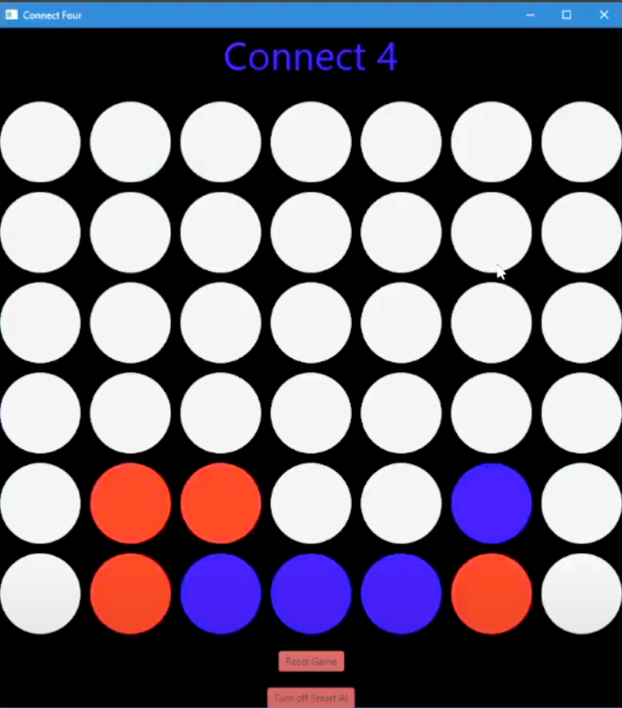

# JavaFX Connect 4 - Texas A&M CS Project

This repository contains the source code and assets for my JavaFX-based Connect 4 game implementation.

## Project Overview

This project implements a fully functional Connect 4 game, with:

* JavaFX GUI
* Game logic handling player moves
* Simple AI for single-player mode

## Project Structure

* `src/application/`: Contains Java source files, FXML UI definitions, and CSS styling:

  * `Main.java`: Entry point for the JavaFX application.
  * `Connect4Controller.java`: Controller handling user interactions and game logic integration.
  * `Connect4.fxml`: Defines the UI layout using JavaFX Scene Builder format.
  * `application.css`: Basic styling for the JavaFX GUI.

* `moves.txt`: A data file logging game moves (optional feature).

## Getting Started

### Prerequisites

* Java 11 or higher.
* JavaFX installed and configured correctly.

### Running the Project

To run the project:

1. Ensure JavaFX SDK is properly set up in your IDE
2. Compile and run `Main.java` to launch the Connect 4 GUI.

## Sample Image from JavaFX Game

